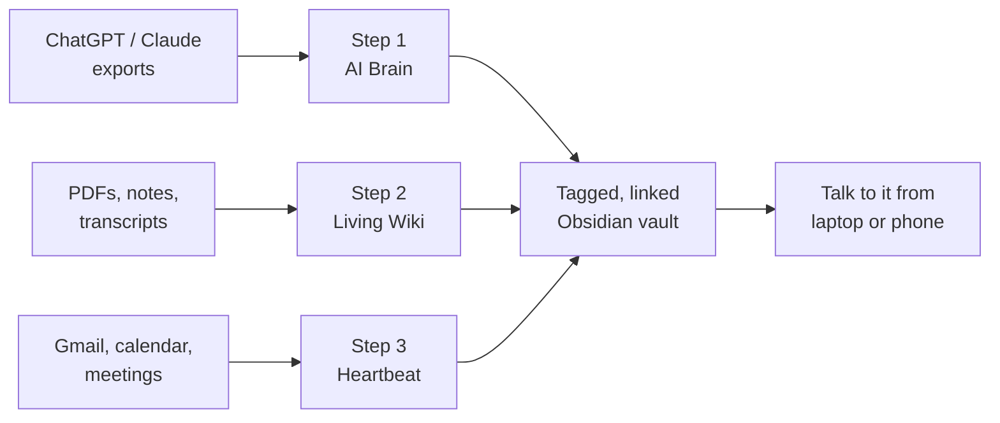

# AI Second Brain

> A practical skill that walks you through building a **living, searchable, AI-powered knowledge base** from your ChatGPT/Claude history, research, and daily inputs — then talking to it from your laptop or phone.

Maintained by **[Yo-Da Lai](https://yodalai.xyz)** · Gold Coast, Australia  
Works with **Claude Code** and **Hermes Agent**.

---

## Why this exists

On 3 April 2026, [Andrej Karpathy](https://github.com/karpathy) published a gist on building a personal wiki with a folder of markdown + an LLM. The idea spread fast for a reason: **RAG re-discovers knowledge every time. A wiki compounds it.**

This skill packages that pattern — plus an AI-history organiser process popularised by [Alex Freedman](https://instagram.com/alex2learn) and slash-command workflows shared by [Greg Isenberg](https://www.youtube.com/@GregIsenberg) — into one guided setup.

Original packaging was released by Charlie Hills (MIT). This is **Yo-Da Lai’s maintained fork**: clearer installs, Hermes + Claude Code paths, a sturdier wiki scaffold, and a share page you can send people to.

**Share page (send people here):** https://ezauto399.github.io/ai-second-brain/  
**GitHub repo:** https://github.com/EzAuto399/ai-second-brain  
**Personal site / work with me:** https://yodalai.xyz

---

## Install

### Option A — Claude Code (recommended for most people)

```bash
git clone https://github.com/EzAuto399/ai-second-brain.git ~/.claude/skills/ai-second-brain
```

If that folder already exists, back it up first:

```bash
mv ~/.claude/skills/ai-second-brain ~/.claude/skills/ai-second-brain.backup
```

Open Claude Code anywhere and say:

> Set up my AI second brain.

Update later:

```bash
cd ~/.claude/skills/ai-second-brain && git pull
```

### Option B — Hermes Agent

```bash
# Personal profile example — adjust the skills path if your Hermes profile differs
git clone https://github.com/EzAuto399/ai-second-brain.git \
  ~/.hermes/profiles/personal/skills/research/ai-second-brain
```

Then in Hermes:

> Load the ai-second-brain skill and set up my AI second brain.

If Hermes already has the built-in `llm-wiki` skill, this skill still helps for the full guided path (exports → vault → channels → slash commands). Use both: this skill for setup, `llm-wiki` for ongoing wiki ops.

### Verify (Claude Code)

```
/skills
```

You should see `ai-second-brain`. If not, the clone path is wrong — re-run Option A.

---

## What it does



Three stages — do all three, or pick one:

1. **AI Brain** — turn ChatGPT + Claude history into tagged, linked markdown in Obsidian.
2. **Living Wiki** — `raw/` sources in, structured wiki pages out (Karpathy-style, with a durable schema).
3. **Heartbeat** — optional connectors + messaging channels + slash commands (`/today`, `/ideas`, `/create`).

Every step the agent can do, it does. Every step only you can do (exports, macOS permissions, browser logins) pauses until you confirm.

---

## What you need

- [Claude Code](https://docs.anthropic.com/claude-code) **or** [Hermes Agent](https://hermes-agent.nousresearch.com/docs)
- [Obsidian](https://obsidian.md) (free)
- ~30 minutes of attention, plus 1–3 days waiting if you request a ChatGPT data export

---

## Trigger phrases

The skill should activate on things like:

- “Set up my AI second brain”
- “Build the Karpathy wiki”
- “Organise my ChatGPT conversations in Obsidian”
- “I exported my ChatGPT data, what now?”
- “Help me set up iMessage / Telegram channels for my wiki”
- “Create the /today, /ideas and /create slash commands”

Already done part of it? Say: “skip step 1, I’ve already done it”.

---

## FAQ

**Does this send my data anywhere?**  
No. Everything lives in folders on your machine. The only network calls are the ones your agent already makes to its model provider. Your conversations, wiki, and raw sources stay local.

**Will it read my email automatically?**  
Only when you ask, and only for the threads relevant to the request. You control connectors and can revoke access anytime.

**Claude Code or Hermes?**  
Both work. Claude Code is the path most newsletter-style walkthroughs assume. Hermes is great if you already run a multi-skill local agent (and may already include `llm-wiki`).

**Can I uninstall the skill?**  
Yes:

```bash
rm -rf ~/.claude/skills/ai-second-brain
# or Hermes path:
rm -rf ~/.hermes/profiles/personal/skills/research/ai-second-brain
```

That removes the skill only. Your Obsidian vault / wiki data stays.

**Does it work on Windows?**  
Steps 1–2 yes. Native iMessage channels are Mac-only — use Telegram/Discord/gateway options instead.

**What if I don’t want messaging channels?**  
Skip that sub-step. You still get a living wiki on your laptop.

**Business / team version?**  
A personal second brain is the right start. If you want a governed **company brain + AI staff** for a real business (approvals, channels, memory), that’s what I build for clients at [yodalai.xyz](https://yodalai.xyz) (ClawConnect by Yoda Lai — AI staff platform).

---

## Credits

Underlying ideas are not mine. This skill exists so setup takes minutes, not a weekend.

- **[Andrej Karpathy](https://github.com/karpathy)** — [original gist](https://gist.github.com/karpathy/442a6bf555914893e9891c11519de94f) for the living markdown wiki pattern (`raw/`, wiki compile loop, LLM as maintainer).
- **Alex Freedman ([@alex2learn](https://instagram.com/alex2learn))** — AI Brain export-and-organise process adapted in Step 1.
- **[Greg Isenberg](https://www.youtube.com/@GregIsenberg)** — slash-command-on-vault workflow that Step 3c is based on.
- **Charlie Hills** — original MIT packaging that this maintained fork builds on.

I (Yo-Da Lai) maintain this fork: dual-agent install, sturdier wiki scaffold, channel options, and the public share page.

---

## About

**Yo-Da Lai** — forward-deployed AI engineer on the Gold Coast, Australia.  
I help non-technical business owners automate real work with AI systems that stay under human approval.

- Site: [yodalai.xyz](https://yodalai.xyz)
- Instagram: [@yodalai.dev](https://www.instagram.com/yodalai.dev/)
- Free 15‑min build review: [yodalai.xyz](https://yodalai.xyz) (book from the site)

If this skill helped, send someone the repo link — or the Pages URL once it’s live on this repository.

---

## Licence

MIT. Fork it, modify it, rebrand it — keep the credits to Karpathy, Alex, Greg, and the original packaging notice.
